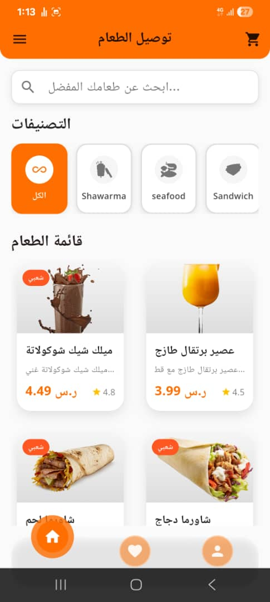
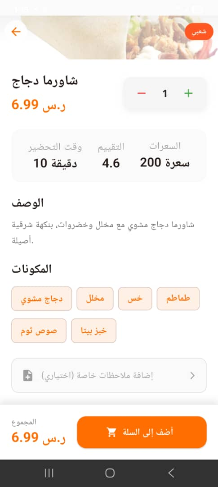
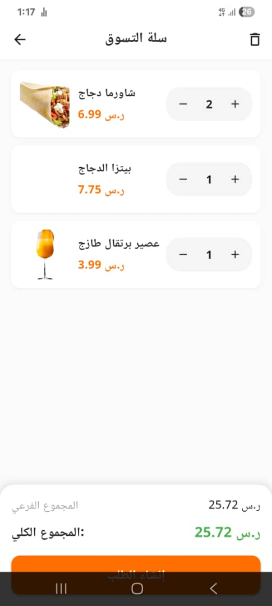
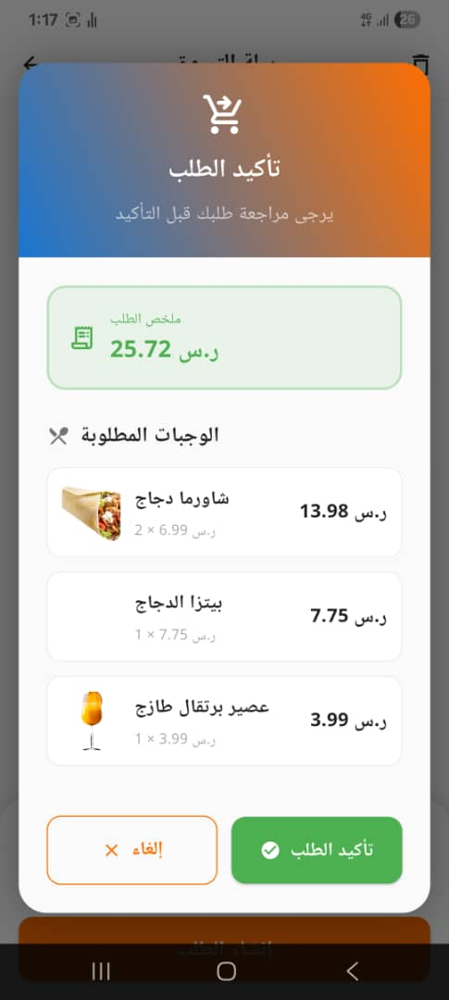
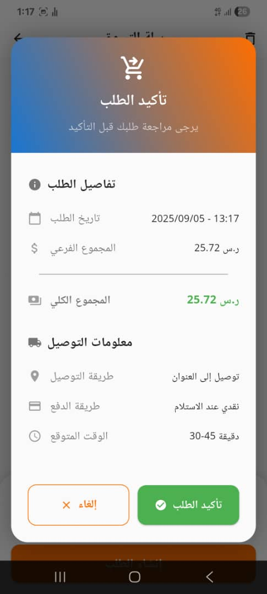
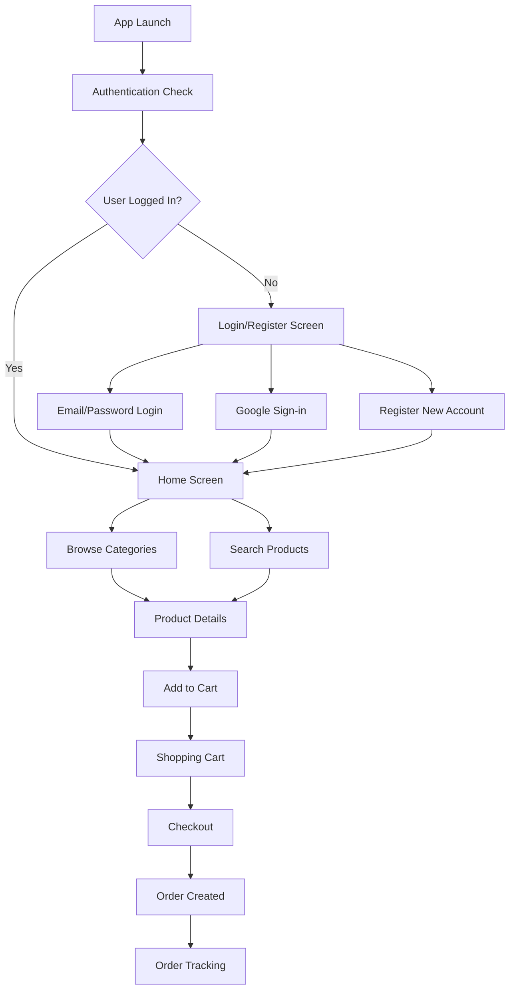

<div align="center">
  
</div>

<div align="center">
  
</div>

# 🍽️ Foodly Delivery - Food Ordering App

<div align="center">
  
  
  
  
  
</div>

<div align="center">
  <h3>🇸🇦 تطبيق توصيل طعام حديث ومتطور يوفر تجربة مستخدم استثنائية</h3>
  <p><strong>Modern food delivery app built with Flutter, offering an exceptional user experience for ordering your favorite meals</strong></p>
</div>

---

## 📱 Application Preview

<div align="center">
  <table>
    <tr>
      <td></td>
      <td></td>
      <td></td>
      <td></td>
      <td>
    </tr>
    <tr>
      <td align="center"><strong>الشاشة الرئيسية</strong></td>
      <td align="center"><strong>تفاصيل المنتج</strong></td>
      <td align="center"><strong>سلة التسوق</strong></td>
      <td align="center"><strong>تفاصيل الطلب</strong></td>
      <td align="center"><strong>تفاصيل الطلب</strong></td>
    </tr>
  </table>
</div>

---

## ✨ Key Features | المميزات الرئيسية

### 🔐 **Authentication & Security**
- 📧 **Email & Password Login** - تسجيل دخول بالبريد الإلكتروني
- 🌟 **Google Sign-in Integration** - تسجيل دخول سريع عبر Google
- 🔄 **Password Recovery** - استعادة كلمة المرور
- 👤 **User Registration** - إنشاء حساب جديد

### 🍕 **Food & Menu Management**
- 📋 **Dynamic Food Categories** - تصنيفات ديناميكية للطعام
- 🔍 **Advanced Search** - بحث متطور في قوائم الطعام
- ⭐ **Product Ratings & Reviews** - تقييمات وآراء المستخدمين
- 📊 **Nutritional Information** - معلومات غذائية (السعرات الحرارية)
- 🏷️ **Popular Items Highlighting** - إبراز الأصناف الشعبية

### 🛒 **Shopping Experience**
- 🛍️ **Smart Shopping Cart** - سلة تسوق ذكية
- ➕ **Quantity Management** - إدارة كميات المنتجات
- 💰 **Real-time Price Calculation** - حساب الأسعار فورياً
- 🗑️ **Cart Management** - إدارة متكاملة للسلة
- 💾 **Persistent Cart Data** - حفظ بيانات السلة

### 📦 **Order Management**
- 🧾 **Order Invoice Generation** - إنشاء فواتير الطلبات
- 📱 **Order Tracking** - تتبع الطلبات برقم مرجعي
- 📅 **Order History** - سجل الطلبات السابقة
- 🔄 **Reorder Functionality** - إعادة طلب سهلة
- 📍 **Delivery Address Management** - إدارة عناوين التوصيل

### 💳 **Payment & Delivery**
- 💸 **Cash on Delivery** - الدفع عند الاستلام
- 🏠 **Default Address Setup** - عنوان توصيل افتراضي
- 🚚 **Order Status Tracking** - تتبع حالة الطلب

---

## 🛠️ Tech Stack | التقنيات المستخدمة

### 🎯 **Frontend Framework**
<div align="center">
  
  
</div>

### 🏗️ **State Management & Architecture**
<div align="center">
  
  
</div>

### 🗄️ **Backend & Database**
<div align="center">
  
  
</div>

### 📚 **Key Dependencies**

```yaml
dependencies:
  flutter:
    sdk: flutter
    
  # UI & Design
  cupertino_icons: ^1.0.8
  flex_color_scheme: ^8.2.0
  google_fonts: ^6.3.1
  animate_do: ^4.2.0
  glassmorphism: ^3.0.0
  glassmorphism_ui: ^0.3.0
  
  # State Management & Navigation
  get: ^4.7.2
  get_storage: ^2.1.1
  
  # Backend & Database
  supabase_flutter: ^2.10.0
  
  # Authentication
  google_sign_in: ^7.1.1
  
  # UI Components
  cached_network_image: ^3.4.1
  curved_navigation_bar: ^1.0.6
  awesome_dialog: ^3.2.1
  
  # Forms & Validation
  flutter_form_builder: ^10.1.0
  form_builder_validators: ^11.2.0
  country_pickers: ^3.0.1
  
  # Media & Files
  image_picker: ^1.2.0
  image_cropper: ^9.1.0
  file_picker: ^10.3.2
  permission_handler: ^12.0.1
  
  # Utilities
  url_launcher: ^6.3.2
  intl: ^0.20.2
  fluttertoast: ^8.2.12
```

---

## 🚀 Getting Started | البدء السريع

### 📋 **Prerequisites | المتطلبات**

- ✅ **Flutter SDK** (3.0.0 or higher)
- ✅ **Dart SDK** (2.17.0 or higher)
- ✅ **Android Studio** / **VS Code**
- ✅ **Android SDK** (API level 21+)
- ✅ **iOS 11.0+** (for iOS deployment)

### 🔧 **Installation | التثبيت**

1. **Clone the repository | استنساخ المشروع**
   ```bash
   git clone https://github.com/ShiroYasha211/foodly_delivery.git
   cd foodly_delivery
   ```

2. **Install dependencies | تثبيت المكتبات**
   ```bash
   flutter pub get
   ```

3. **Setup Supabase | إعداد Supabase**
   - Create a new Supabase project
   - Copy your project URL and anon key
   - Update the configuration in `lib/core/constants/app_constants.dart`

4. **Google Sign-in Setup | إعداد تسجيل الدخول عبر Google**
   - Configure Google OAuth in your Supabase project
   - Add your SHA-1 fingerprint for Android
   - Update `google-services.json` for Android

5. **Run the app | تشغيل التطبيق**
   ```bash
   flutter run
   ```

---


## 🎨 UI/UX Design Features | مميزات التصميم

### 🌟 **Design Principles**
- 🎨 **Material Design** with custom theming
- 🌙 **RTL Support** for Arabic language
- 📱 **Responsive Design** for different screen sizes
- ✨ **Smooth Animations** with `animate_do` package
- 🔮 **Glassmorphism Effects** for modern UI
- 🎭 **Custom Color Schemes** with `flex_color_scheme`

### 🎯 **User Experience**
- ⚡ **Fast Loading** with cached network images
- 🔄 **Pull to Refresh** functionality
- 💾 **Offline Storage** with GetStorage
- 🔔 **Toast Notifications** for user feedback
- 📱 **Curved Navigation Bar** for better UX

---

## 🔑 Core Functionality | الوظائف الأساسية

### 🏠 **Home Screen**
- Dynamic food categories display
- Search functionality for food items
- Popular items highlighting
- Category-based filtering

### 🍽️ **Product Details**
- High-quality food images
- Detailed product descriptions
- Nutritional information display
- Quantity selection
- Add to cart functionality

### 🛒 **Shopping Cart**
- Real-time cart updates
- Quantity modification
- Price calculations
- Cart clearing with confirmation
- Persistent cart data

### 📦 **Order Management**
- Order creation and tracking
- Invoice generation
- Order status updates
- Order history
- Reorder functionality

---

## 📊 App Flow | تدفق التطبيق



---

## 🔮 Future Enhancements | التطويرات المستقبلية

### 🚀 **Planned Features**
- [ ] 💳 **Multiple Payment Methods** (Credit Cards, Digital Wallets)
- [ ] 🗺️ **GPS Integration** for real-time delivery tracking
- [ ] 🔔 **Push Notifications** for order updates
- [ ] ⭐ **Review & Rating System** for restaurants
- [ ] 🎯 **Recommendation Engine** based on user preferences
- [ ] 🏪 **Multi-restaurant Support**
- [ ] 🌙 **Dark Mode** theme support
- [ ] 🌐 **Multi-language Support**
- [ ] 📱 **iOS Version** optimization
- [ ] 🎁 **Loyalty Program** and rewards system

### 🔧 **Technical Improvements**
- [ ] 🧪 **Unit & Widget Testing**
- [ ] 📊 **Analytics Integration**
- [ ] 🔄 **Offline Mode** capabilities
- [ ] ⚡ **Performance Optimization**
- [ ] 🛡️ **Enhanced Security** features

---

## 🤝 Contributing | المساهمة

We welcome contributions! Here's how you can help:

1. **🍴 Fork the repository**
2. **🌿 Create a feature branch** (`git checkout -b feature/amazing-feature`)
3. **💫 Commit your changes** (`git commit -m 'Add amazing feature'`)
4. **🚀 Push to the branch** (`git push origin feature/amazing-feature`)
5. **📝 Open a Pull Request**

### 📋 **Contribution Guidelines**
- Follow Flutter/Dart best practices
- Maintain code consistency
- Add comments for complex logic
- Test your changes thoroughly
- Update documentation if needed

---

## 👨‍💻 Developer | المطور

<div align="center">
  
  
  **Mohammed Alhemyari**  
  *Flutter Developer | Mobile App Developer*
  
  [](https://www.linkedin.com/in/mohammed-alhemyari-bb0352248/)
  [](https://github.com/ShiroYasha211)
  [](mailto:samehing211@gmail.com)
</div>

---

## 💬 Support | الدعم

If you found this project helpful, please consider:

- ⭐ **Starring the repository**
- 🐛 **Reporting issues**
- 💡 **Suggesting new features**
- 🤝 **Contributing to the codebase**

---

<div align="center">
  
</div>

<div align="center">
  <p><i>"Building the future of food delivery, one commit at a time"</i></p>
</div>

---

<div align="center">
  
</div>
